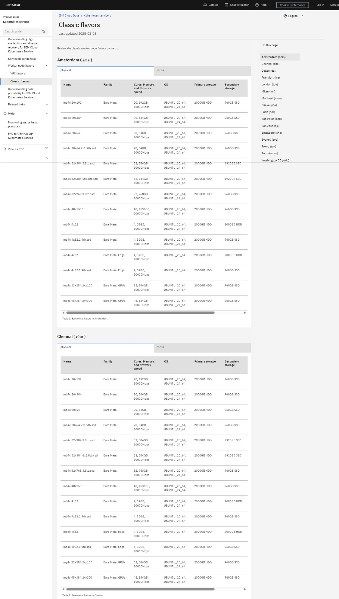
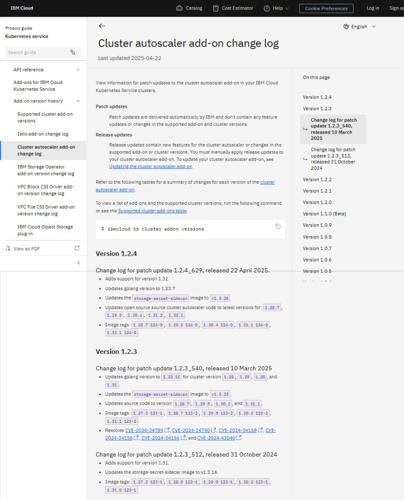

# Automating

Take a look at these examples of topics that are automatically updated by daily automation.

## Markdown Enricher

[Github repo](https://github.com/IBM/md-enricher-for-cicd)

## Link checker

## Topics updated from the IBM Cloud Kubernetes Service API

### Cluster flavors

### Cluster add-on versions

### Region availability for service resources

### Supported operating system versions

### Change logs

