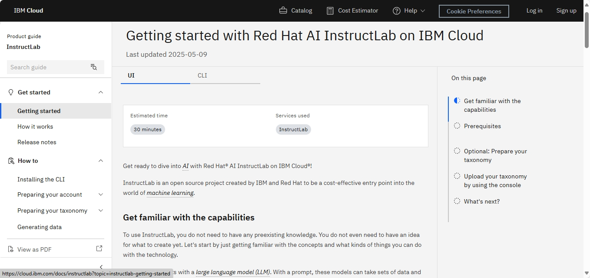
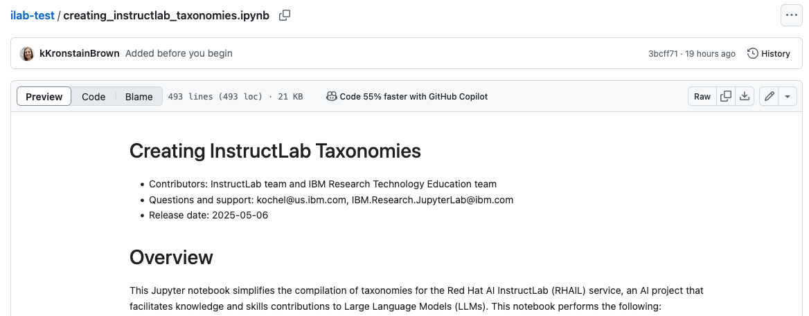
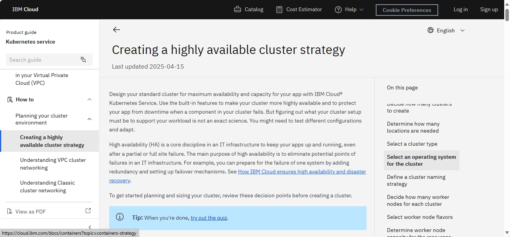
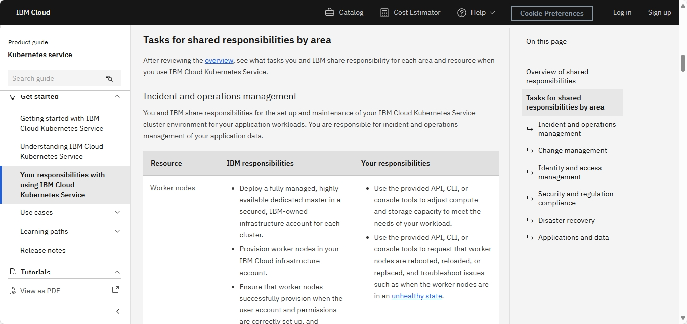
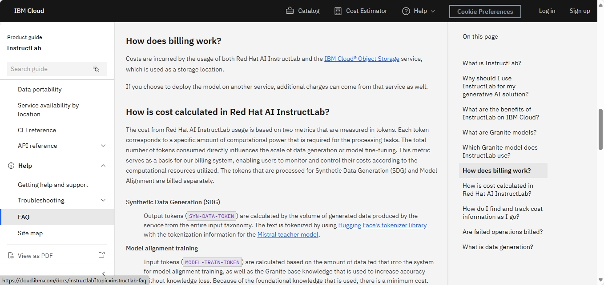
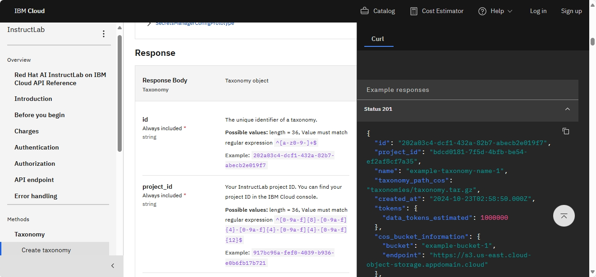
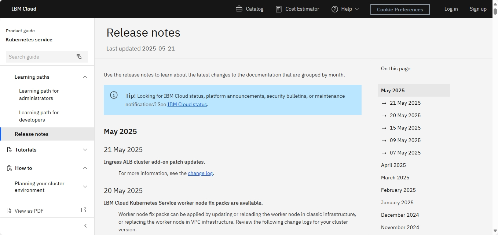
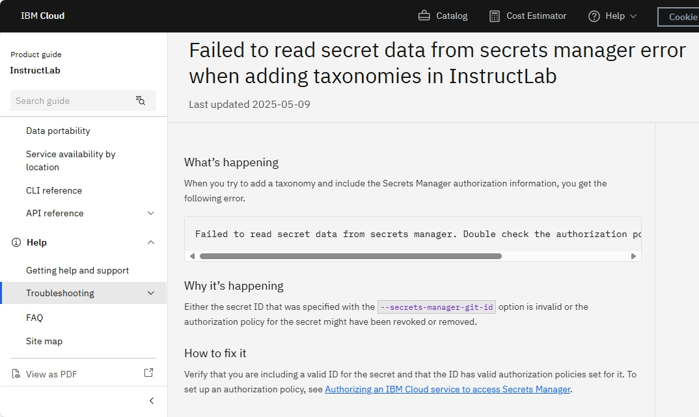
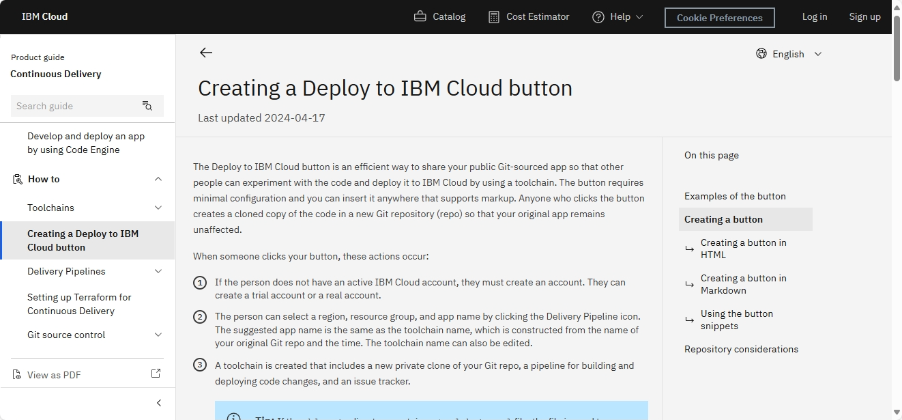
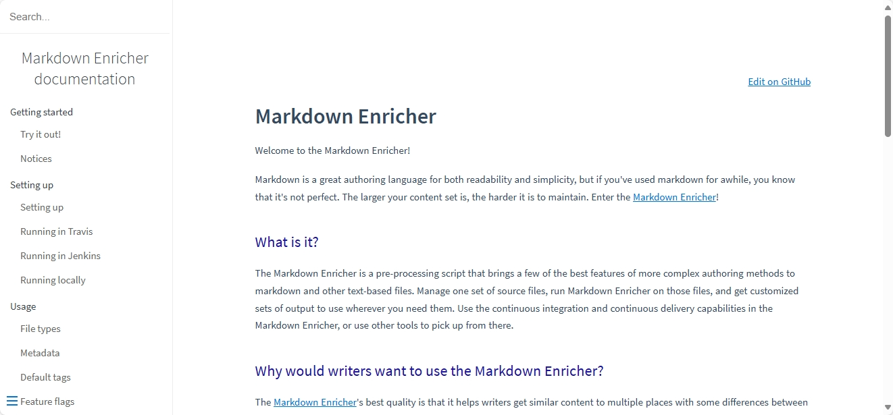

# Writing samples for Kristin Brown

In my 16 years with IBM, I have written for dozens of products and services, including:
- InstructLab service on IBM Cloud
- Kubernetes service on IBM Cloud
- OpenShift service on IBM Cloud
- Registry service on IBM Cloud
- Openwhisk service on IBM Cloud
- DevOps and Delivery Pipeline service on IBM Cloud
- No code app development service on IBM Cloud
- Logging and monitoring services on IBM Cloud
- Reporting software for the Rational brand
- Installation software for the Rational brand
- Asset management software for the Rational brand
- Project management software for the Rational brand

Here are a few writing samples from the services that are publicly available.


## Getting started with AI

My introduction to large-language modeling for AI has been through writing documentation for the Red Hat AI InstructLab on IBM Cloud. The service makes it possible to generate synthetic data and models from QNA files as part of a taxonomy. 

With a service like this, there must be balance. We want to make the purpose and value of the service clear. But we don't want to over-document the capabilities of InstructLab. Red Hat has its own documentation for that. We don't want to over-document what you do with the model. There are other services to deploy the model in with their own documentation. So context is so important to keep in mind in each topic, though especially in the Getting Started topic.

View the topic: [https://cloud.ibm.com/docs/instructlab?topic=instructlab-getting-started](https://cloud.ibm.com/docs/instructlab?topic=instructlab-getting-started&interface=ui)




## Reviewing Jupyter notebook for the InstructLab service

I tested the steps and edited the markdown content in a Jupyter notebook for IBM Research. These steps teach InstructLab service users how to create QNA files and a taxonomy to begin creating their own AI models.

- [Original notebook](https://github.com/KenOcheltree/ilab-test/blob/41b44af968cdb073d2ce60020f9080ac6f573ad3/creating_instructlab_taxonomies.ipynb)
- [Revised notebook by me](https://github.com/KenOcheltree/ilab-test/blob/e1cc3c22d3702007af70edae9e4b8ba2678c59fb/creating_instructlab_taxonomies.ipynb)
- [Diff](https://github.com/KenOcheltree/ilab-test/pull/16/files)




## Strategy for high availability

Use cases for a service can be varied. You might have users just perusing, looking to understand what a service is capable of. But then you might have subject matter experts who are looking for intricate details of the architecture. Conceptual topics are a great delivery system for information that bridges the gaps between those user experiences. 

With the IBM Cloud Kubernetes Service, users have a high degree of flexibility in the setup of their Kubernetes clusters. This flexibility can give them a sense of ownership, but it can also allow them to make short cuts that aren't always in their best interest. I consolidated many best practices around high availability and disaster recovery into a topic that helps guide users through the process of establishing a strategy for cluster management. 

Each section of this topic is a decision point for the cluster admin to make, including recommendations to lead them toward best practices.

View the topic: [https://cloud.ibm.com/docs/containers?topic=containers-strategy](https://cloud.ibm.com/docs/containers?topic=containers-strategy)




## Responsibilities

I worked with a distinguished engineer to develop the original version of the Responsibilities topic. Though the idea for the topic was his, we worked together to find the right level of detail to describe what IBM's service maintenance responsibilities were versus what the customer responsibilities were. 

As we worked on the topic, I continually considered how we were making the service and IBM look.
- Are we accurately representing the information?
- Are we making it visually obvious that IBM holds the majority of the responsibilities, making this a marketing opportunity? 
- Can the customer can clearly understand which pieces they are responsible for and navigate to information about those pieces?

We got positive feedback on the high-level clarity that the information brought to the users. Eventually, this topic became a standard in IBM Cloud Docs and is used in many of its services.

View the topic: [https://cloud.ibm.com/docs/containers?topic=containers-responsibilities_iks](https://cloud.ibm.com/docs/containers?topic=containers-responsibilities_iks)




## FAQ

I wrote many of the IBM Cloud InstructLab Service FAQ entries. I added several entries around billing this year. Billing can be a tricky area to write about. The information must describe how costs are calculated, but without providing concrete numbers. IBM has separate pricing calculators for that, so we must avoid potentially providing information that could conflict. 

View the topic: [https://cloud.ibm.com/docs/instructlab?topic=instructlab-faq](https://cloud.ibm.com/docs/instructlab?topic=instructlab-faq)




## API docs

As a writer and user of API documentation, it can be a struggle to understand how to use API docs effectively. API docs are usually documented in a way that makes users combine different pieces of information for themselves, which can be a frustrating endeavor, especially for new users.

There is a tendency with technical writers to cover the user interface and command line tasks well, but often API tasks aren't included. Just like command line documentation, it can be helpful for users to see the order of calls that need to be made to achieve a desired outcome. 

As I write API docs, I try to keep in mind:

- What information does this call give me? 
- What do I need to include in the payload and in what format?
- What information should I expect back and in what format?
- What errors might user hit and how do they get past them?

The generation of API doc specification files are usually a collaboration with development. My role is to review and contribute changes back in code via Git pull requests. The JSON or YAML file is automatically built by using Swagger or OpenAPI. If there are content validation errors or issues, I can usually help resolve them.

View the topic: [https://cloud.ibm.com/apidocs/instructlab](https://cloud.ibm.com/apidocs/instructlab)




## Release notes

Though release notes might not take a lot of skill to put together, timeliness is an important part of information development. A new feature cannot be considered delivered if users don't know it's there. 

I use agile methodologies to meet deadlines and automation wherever possible to make updates to production content in a timely manner. 

View the topic: [https://cloud.ibm.com/docs/containers?topic=containers-containers-relnotes](https://cloud.ibm.com/docs/containers?topic=containers-containers-relnotes)




## Troubleshooting

For the IBM Cloud InstructLab Service troubleshooting docs, I was given the following information from development.

```
Failed to read secret data from secrets manager. Double check the authorization policy and that the secret exists.
```

I turned that information into the following topic.




## Deploy to IBM Cloud button

I wrote the original version of this the topic on how to create a Deploy to IBM Cloud button for a Readme in a Git repository. My version of the topic was originally sourced in DITA and eventually migrated to markdown.

I remember discussing repeatedly with the developer the number of conditions and considerations that the button creators would need to be aware of and were therefore included in this topic. The length of the topic revealed the design flaws in something that was meant to be quick and easy. Thankfully, the complexities were simplified and this topic became much slimmer over time due in part to the conversations we had.

View the topic: [https://cloud.ibm.com/docs/ContinuousDelivery?topic=ContinuousDelivery-deploy-button](https://cloud.ibm.com/docs/ContinuousDelivery?topic=ContinuousDelivery-deploy-button)




## Markdown Enricher

The Markdown Enricher is not a service on IBM Cloud, but created by me for use by my own team and later all of IBM Cloud Docs. I developed a Python-based CI/CD pre-processing tool for markdown. Our team needed to single-source markdown files, share them across services, and deliver them to different downstream public and enterprise Github repositories. It includes content parsing, a variety of content validation steps, and both CLI and API calls for failover attempts to deliver the files.

Though the scripts and this documentation are maintained and developed internally at IBM, the Markdown Enricher itself is used to provide a subset of the capabilities publicly.

View the Markdown Enricher documentation in Github pages:
[https://ibm.github.io/md-enricher-for-cicd](https://ibm.github.io/md-enricher-for-cicd/#/)


